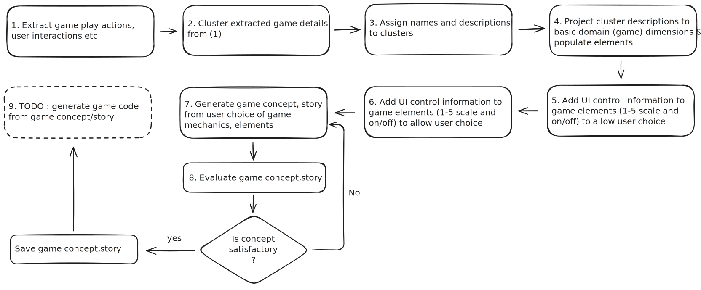

# Game Mechanics Analysis and Generation Tool

A Python-based tool for analyzing and categorizing game mechanics from textual game descriptions using LLM (Large Language Model) technology.

## 🎯 Overview

This project provides a framework for analyzing game mechanics by processing game descriptions and categorizing them into meaningful patterns. It uses an LLM to identify core gameplay elements, player interactions, and game mechanics patterns.

## 🏗️ Architecture

### Flow

The project consists of five main components:

### 1. Game Analysis Runner (`analyze_games.py`)
- Manages the overall analysis pipeline
- Handles loading and processing of game descriptions  
- Coordinates the analysis workflow
- Provides formatted output of results

### 2. Game Mechanics Analyzer (`core/analyzer.py`) 
- Discovers and categorizes game actions and mechanics
- Clusters game actions and mechanics into categories and describes the clusters
- Integrates with LLM client for analysis

### 3. Game Mechanics Processor (`core/game_mechanic_blocks.py`)
- Extracts core gameplay patterns from initial set of game mechanics and category descriptions
- Processes mechanics into structured categories
- Handles JSON processing and validation
- Formats analysis output

### 4. MechanicsUIProcessor (`game_forge/ui_processor.py`)
- Processes game mechanics and determines appropriate UI controls
- Uses LLM to decide between scale (1-5) and toggle controls
- Handles JSON processing and validation

### 5. GameStoryGenerator (`game_forge/story_gen.py`)
- Generates creative game concepts from mechanics combinations
- Provides scoring and feedback on generated concepts
- Includes regeneration of game stories based on quality evaluation


## 🚀 Features

- Automated discovery of game mechanics categories
- LLM-powered analysis of gameplay patterns
- Clustering of similar mechanics
- Automated UI control type determination
- Story generation with quality assessment
- Automatic story regeneration for low-quality outputs

## 📋 Requirements

- Python 3.11.x
- OpenAI API access (for LLM functionality)
- Required Python packages (specify in requirements.txt)

## 💻 Usage

```python
from analyze_gen_games import GameAnalysisRunner
from core import GameMechanicsAnalyzer, GameMechanicsProcessor, save_category_descriptions
from game_forge.ui_processor import MechanicsUIProcessor
from llm.openai_client import OpenAIClient
from pathlib import Path

# Initialize the runner
runner = GameAnalysisRunner(data_dir=Path("./data")) #change this to your csv path

# Run analysis on a sample of games
results = runner.run_analysis(num_games=3)

# Initialize UI processor
processor = MechanicsUIProcessor(OpenAIClient(model="gpt-4o"))

# Process the game design elements
mechanics_json = processor.process_game_design_elements(patterns)

# For testing select a subset of mechanics and generate game concepts
selector = GameMechanicsSelector(mechanics_json)
selected_mechanics = selector.get_random_subset(complexity=3)

# Generate game concepts
generated_stories = generate_game_concepts(selected_mechanics)

# Save the generated game concepts
save_generated_stories(generated_stories)
```

## 📊 Output Format

The analysis produces structured output including:

```json
{
  "core_mechanics": [],
  "player_interactions": [],
  "progression_elements": [],
  "resource_types": [],
  "challenge_patterns": []
}
```

## 🔧 Configuration

The tool can be configured through:
- LLM client settings
- Clustering method selection
- Category description parameters
- Analysis sample size

## 📁 Project Structure

```
.
├── analyze_gen_games.py
├── descriptors.csv # game name, description file mapping
├── desscriptors
│   ├── *.txt # game descriptions
├── core/
│   ├── analyzer.py
│   └── game_mechanic_blocks.py
├── clustering/
│   └── base.py
│   └── llm_clusterer.py
├── discovery/
│   ├── mechanics_discovery.py
├── game_forge/
│   ├── ui_processor.py
│   └── story_gen.py
├── llm/
│   └── openai_client.py

```


## 🔍 Future Improvements

- Support for additional LLM providers
- Enhanced clustering algorithms
- Interactive analysis interface
- Generate game code from game concepts
## 🎮 Sample Analysis Results

### Game Mechanics Analysis Results

After processing 3 games (Minesweeper, Final Fantasy, and Castlevania), the system identified the following game mechanics and patterns:

```json
{
  "core_mechanics": [
    "grid_manipulation",
    "spatial_navigation",
    "hazard_identification",
    "combat_engagement",
    "character_development",
    "resource_allocation"
  ],
  "player_interactions": [
    "grid_interaction",
    "environment_exploration",
    "obstacle_avoidance",
    "enemy_encounter",
    "skill_upgrading",
    "inventory_management"
  ],
  "progression_elements": [
    "level_completion",
    "skill_tree_advancement",
    "experience_gain",
    "story_unfolding",
    "equipment_upgrade"
  ],
  "resource_types": [
    "puzzle_pieces",
    "navigation_tools",
    "health_and_safety_items",
    "weapons_and_armor",
    "experience_points",
    "inventory_items"
  ],
  "challenge_patterns": [
    "puzzle_solving",
    "spatial_puzzles",
    "timed_avoidance",
    "enemy_defeat",
    "level_difficulty_increase",
    "resource_scarcity"
  ]
}
```

### Game Concept Results
See the sample JSON output from game concept generation saved in the `stories` folder.

```json
{
  "story": {
    "story": "Title: 'Chrono Couriers: The Timebound Trade'\n\nOverview:\nIn 'Chrono Couriers: The Timebound Trade', players step into the shoes of elite couriers in a bustling, futuristic metropolis where time is the most precious commodity. As a courier, your mission is to manage resources efficiently, deliver critical items across the city, and engage in real-time action to outmaneuver competitors and environmental challenges. The game combines strategic decision-making with dynamic, real-time gameplay, offering a unique blend of resource management and action.\n\nCore Gameplay Loop:\nThe core gameplay revolves around managing your courier's resources, primarily time and in-game currency, to deliver items across the city. Players must make strategic choices about which delivery routes to take, balancing the urgency of deliveries with the potential rewards. As you progress, you unlock new resources and expand your influence across different city districts, each with its own challenges and opportunities.\n\nGameplay Scenarios:\n1. **Rush Hour Challenge:** During peak hours, the city becomes a maze of traffic and environmental obstacles. Players must decide whether to take a longer, less congested route or risk the shorter, busier path. The choice impacts delivery time and potential bonuses.\n\n2. **Collaborative Contracts:** Occasionally, players can team up with others to tackle large delivery contracts. These require coordination and strategic planning, as players must decide how to split tasks and share resources to maximize efficiency and rewards.\n\n3. **Dynamic Weather Events:** Although environmental factors are minimal, sudden weather changes can occur, such as a surprise rainstorm that slows down traffic. Players must adapt quickly, using their strategic skills to reroute deliveries or adjust their plans on the fly.\n\nDifficulty and Complexity Progression:\nThe game starts with simple delivery tasks and gradually introduces more complex scenarios. As players expand their territory, they face increased resource scarcity, requiring them to optimize their routes and delivery strategies. Unlocking new resources, such as faster vehicles or advanced navigation tools, provides incremental advantages but requires careful investment of in-game currency.\n\nUnique and Engaging Elements:\nWhat sets 'Chrono Couriers' apart is its emphasis on strategic resource management within a real-time action framework. The combination of making high-stakes decisions under time constraints and adapting to dynamic situations keeps players engaged and challenged. The collaborative aspect adds a layer of social interaction, encouraging players to form alliances and strategize together. The game's progression system, focused on expanding influence and unlocking new resources, ensures a rewarding sense of growth and achievement.\n\nIn 'Chrono Couriers: The Timebound Trade', every second counts, and every decision can tip the balance between success and failure. Are you ready to become the city's most renowned courier and master the art of timebound trade?\""
  },
  "mechanics": {
    "core_mechanics": {
      "display_name": "Core Mechanics",
      "elements": [
        {
          "name": "Manage resources",
          "display_name": "Manage Resources",
          "input_type": "scale",
          "scale": {
            "min": 1,
            "max": 5,
            "default": 3,
            "step": 1
          },
          "value": 4
        },
        {
          "name": "Deliver items",
          "display_name": "Deliver Items",
          "input_type": "scale",
          "scale": {
            "min": 1,
            "max": 5,
            "default": 3,
            "step": 1
          },
          "value": 3
        },
        {
          "name": "Engage in real-time action",
          "display_name": "Engage In Real-Time Action",
          "input_type": "toggle",
          "default": false,
          "value": true
        }
      ]
    },
    "player_interactions": {
      "display_name": "Player Interactions",
      "elements": [
        {
          "name": "Make strategic choices",
          "display_name": "Make Strategic Choices",
          "input_type": "scale",
          "scale": {
            "min": 1,
            "max": 5,
            "default": 3,
            "step": 1
          },
          "value": 5
        },
        {
          "name": "Adapt to dynamic situations",
          "display_name": "Adapt To Dynamic Situations",
          "input_type": "scale",
          "scale": {
            "min": 1,
            "max": 5,
            "default": 3,
            "step": 1
          },
          "value": 3
        },
        {
          "name": "Collaborate with other players",
          "display_name": "Collaborate With Other Players",
          "input_type": "scale",
          "scale": {
            "min": 1,
            "max": 5,
            "default": 3,
            "step": 1
          },
          "value": 3
        }
      ]
    },
    "progression_elements": {
      "display_name": "Progression Elements",
      "elements": [
        {
          "name": "Unlock new resources",
          "display_name": "Unlock New Resources",
          "input_type": "scale",
          "scale": {
            "min": 1,
            "max": 5,
            "default": 3,
            "step": 1
          },
          "value": 4
        },
        {
          "name": "Expand territory or influence",
          "display_name": "Expand Territory Or Influence",
          "input_type": "scale",
          "scale": {
            "min": 1,
            "max": 5,
            "default": 3,
            "step": 1
          },
          "value": 5
        },
        {
          "name": "Upgrade abilities or tools",
          "display_name": "Upgrade Abilities Or Tools",
          "input_type": "scale",
          "scale": {
            "min": 1,
            "max": 5,
            "default": 3,
            "step": 1
          },
          "value": 1
        }
      ]
    },
    "resource_types": {
      "display_name": "Resource Types",
      "elements": [
        {
          "name": "Time constraints",
          "display_name": "Time Constraints",
          "input_type": "scale",
          "scale": {
            "min": 1,
            "max": 5,
            "default": 3,
            "step": 1
          },
          "value": 3
        },
        {
          "name": "Environmental factors",
          "display_name": "Environmental Factors",
          "input_type": "scale",
          "scale": {
            "min": 1,
            "max": 5,
            "default": 3,
            "step": 1
          },
          "value": 1
        },
        {
          "name": "In-game currency",
          "display_name": "In-Game Currency",
          "input_type": "scale",
          "scale": {
            "min": 1,
            "max": 5,
            "default": 3,
            "step": 1
          },
          "value": 3
        }
      ]
    },
    "challenge_patterns": {
      "display_name": "Challenge Patterns",
      "elements": [
        {
          "name": "Environmental obstacles",
          "display_name": "Environmental Obstacles",
          "input_type": "scale",
          "scale": {
            "min": 1,
            "max": 5,
            "default": 3,
            "step": 1
          },
          "value": 3
        },
        {
          "name": "Resource scarcity",
          "display_name": "Resource Scarcity",
          "input_type": "scale",
          "scale": {
            "min": 1,
            "max": 5,
            "default": 3,
            "step": 1
          },
          "value": 5
        },
        {
          "name": "Dynamic changes in game state",
          "display_name": "Dynamic Changes In Game State",
          "input_type": "scale",
          "scale": {
            "min": 1,
            "max": 5,
            "default": 3,
            "step": 1
          },
          "value": 1
        }
      ]
    }
  },
  "score": 4,
  "attempts": 1,
  "generation_time": "20241110_123239"
}
```

## ⚠️ Notes

- Ensure proper API credentials are configured
- Set the LLM API key in a .env file or in an environment variable
- Large game descriptions may require additional processing time
- Results may vary based on LLM model used. Only OpenAI models are supported at this time.
- Update the path in `game_forge/ui_processor.py` and `game_forge/story_gen.py` to point to the root of the project
---
